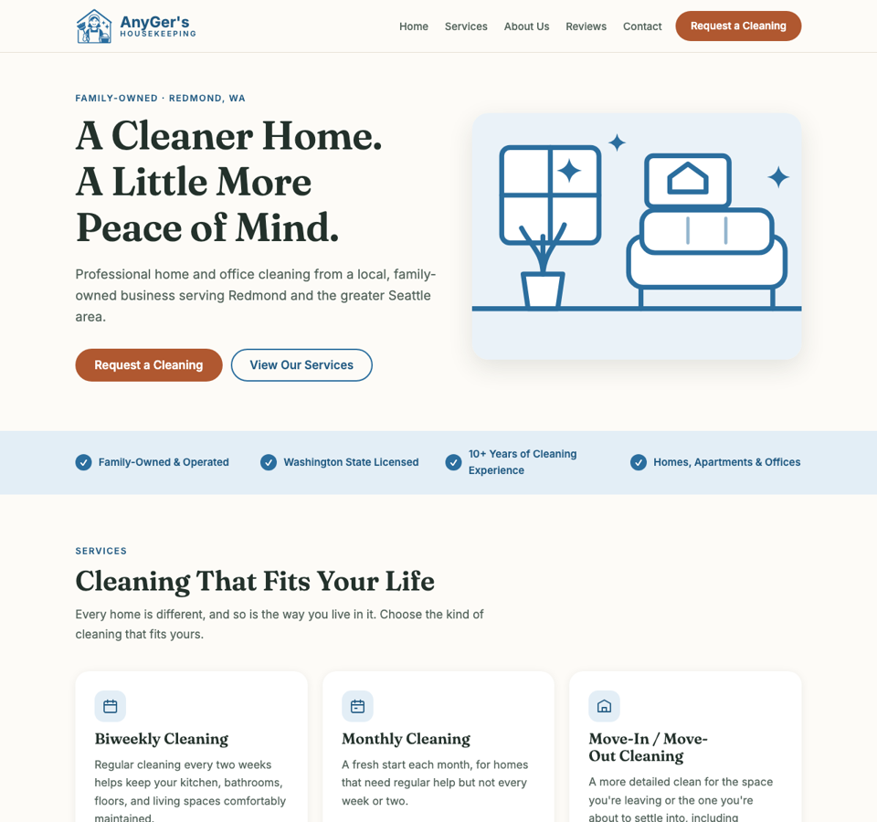

# AnyGer's Housekeeping Website

A fast, accessible, mobile-first marketing website for **AnyGer's Housekeeping**, a family-owned cleaning business in Redmond, Washington.



## Why this exists

The business already had a separate booking application. What it lacked was a trustworthy front door: a place where a new customer can learn who we are, what we clean, and why they can feel comfortable inviting us into their home, then request a cleaning in one click.

This site does that one job and nothing else. It is both a real website for a real family business and a software-engineering portfolio project.

## How it fits together

```
Visitor -> Marketing website (this repo) -> "Request a Cleaning" -> Booking app
                                                                     |
                                           https://anyger-housekeeping.onrender.com/book
```

The website explains the business and builds trust. Every "Request a Cleaning" button links to the existing [booking application](https://github.com/Barrientosgers/anyger-housekeeping), which handles requests. There is deliberately no backend, form, or database here.

## What I built

- Single-page responsive layout: hero, trust strip, six service cards, family story, how-it-works steps, testimonials, final call to action, footer
- Mobile menu that degrades gracefully without JavaScript
- Self-hosted fonts (no third-party requests)
- Local SEO: meta tags, Open Graph, `LocalBusiness` JSON-LD, sitemap, robots.txt
- Accessibility work: semantic landmarks, skip link, visible focus states, contrast checked against WCAG AA, alt text, ordered/unordered lists for real lists
- Honest content rules: only real, permitted reviews, and no invented awards, statistics, or contact details

## Technology

Plain **HTML, CSS, and about 20 lines of JavaScript**. No framework, no build step, no dependencies.

That was a deliberate choice: one marketing page does not need React. Plain files load fast, are easy to maintain, and keep hosting at $0.

## Project structure

```
index.html          the whole page
css/styles.css      design tokens + styles, organized in numbered sections
js/menu.js          mobile menu toggle
images/             logo, hero illustration, share image
fonts/              self-hosted Inter and Fraunces
robots.txt, sitemap.xml
.github/workflows/  GitHub Pages deployment
docs/               README assets
```

## Run it locally

You need Python 3 (already on macOS). From the project folder:

```bash
python3 -m http.server 8000
```

Then open http://localhost:8000. Stop with `Ctrl+C`.

## Editing content

- **Testimonials:** real reviews, used with the customers' permission and attributed by first name and last initial. To add one, copy a `<li class="quote">` block in the Reviews section of `index.html` (instructions are in a comment there). Only use a customer's exact words, never invented ones.
- **Colors and sizes:** change the variables at the top of `css/styles.css`.
- **Site address:** if the URL changes (renamed repo or custom domain), update it in `index.html` (canonical, Open Graph, JSON-LD), `sitemap.xml`, and `robots.txt`.

## Deployment

Hosted for free on **GitHub Pages**. `.github/workflows/deploy.yml` packages the site files and publishes them.

```
Edit -> git commit -> git push -> GitHub Actions -> live site
```

The workflow runs automatically on every push to `main`, and can also be started by hand from the repository's Actions tab.

## Git workflow

Work happens on short-lived feature branches (`feat/...`, `fix/...`, `docs/...`), merged into `main` with merge commits, using [Conventional Commits](https://www.conventionalcommits.org/) (`feat:`, `fix:`, `docs:`, `chore:`).

## What I learned

- Planning and design approval before coding keeps scope small and avoids rework.
- Git branches, small commits, and merges as a safety net.
- Responsive, mobile-first CSS using design tokens, grid, and flexbox.
- Accessibility is measurable: contrast ratios, focus states, landmarks, and keyboard use.
- Technical SEO basics: canonical URLs, Open Graph, structured data.
- Choosing the simplest tool that solves the problem, and keeping hosting at $0.
- Honesty in content: placeholders stay labeled until they are replaced with real, permitted content.

## Credits

Designed and built by Gerson Barrientos for his family's business, with AI pair-programming assistance from Claude Code.

&copy; 2026 AnyGer's Housekeeping
